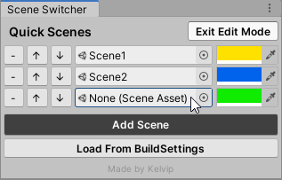

# QuickSceneSwitcher for Unity
A unity tool for quick access to switch between scenes.

# Installation

  1. Open the package manager
  2. Click the **+** and choose **Add package from git URL**
  3. Paste **this URL**: https://github.com/Kelvin-CD/Quick-Scene-Switcher.git#upm
  4. Wait for unity to install the package
  5. Done!

# Usage

- To open the tool, click on the window tab inside unity and choose **Quick Scene Switcher**.
- To add scenes you have to enter **EditMode**.
- Then just click on Add Scene, and drag and drop a scene asset on to the slot.

  

- You can choose the **color** of each button by using the color pickers on the right.
- That's it, have fun!
